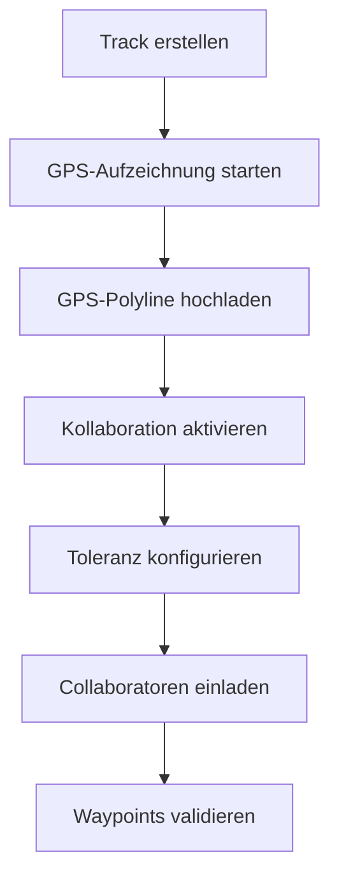
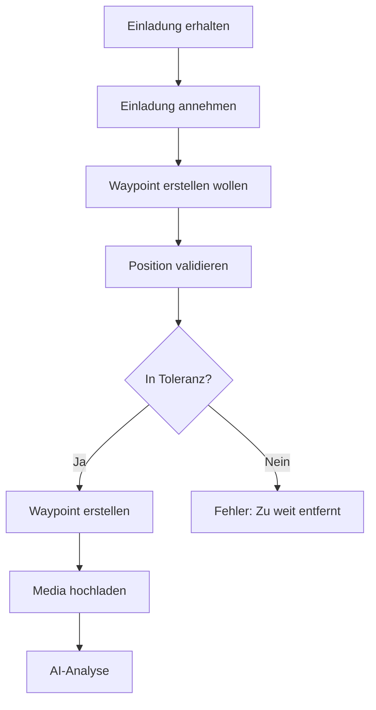

# 🎯 Kollaborative Tracks - Vollständige Spezifikation

## 📋 **Konzept**

### **Grundprinzip:**
- **Track Owner** erstellt Track und lädt GPS-Polyline hoch
- **Collaboratoren** können nur Waypoints hinzufügen (keine GPS-Daten)
- **Proximity-Validation** stellt sicher, dass Waypoints nah am Track sind
- **Orthogonale Projektion** findet kürzesten Abstand zur Track-Polyline

## 🏗️ **Architektur**

### **1. Track-Daten-Trennung**
```
Track Owner:
✅ Lädt GPS-Polyline hoch (Waypoints mit GPS-Track-Daten)
✅ Konfiguriert Proximity-Toleranz
✅ Verwaltet Collaboratoren

Collaboratoren:
✅ Fügen nur Media-Waypoints hinzu (Fotos, Videos, Audio, Notizen)
❌ KEINE GPS-Track-Daten
✅ Waypoints werden gegen Owner's Track validiert
```

### **2. Proximity-Validation System**

#### **Orthogonale Projektion:**
```python
def find_closest_point_on_track(waypoint, track_polyline):
    """
    1. Für jedes Track-Segment (P1 → P2):
       - Projiziere Waypoint orthogonal auf Segment
       - Berechne Distanz mit Haversine-Formel
    
    2. Finde Segment mit kürzester Distanz
    
    3. Berechne:
       - closest_point: GPS-Koordinaten des nächsten Punkts
       - distance_meters: Entfernung in Metern
       - track_position_km: Position entlang Track (0 = Start)
       - projection_ratio: Position im Segment (0.0-1.0)
    """
```

#### **Toleranz-Konfiguration:**
```python
ProximityPresets = {
    "hiking_strict": 50m,     # Wandern (strikt)
    "hiking_relaxed": 200m,   # Wandern (entspannt)
    "cycling": 100m,          # Radfahren
    "driving": 500m,          # Autofahren
    "mountaineering": 30m     # Bergsteigen (präzise)
}
```

## 🔧 **API-Endpoints**

### **Track Collaboration Management**
```
POST   /tracks/{id}/collaborate          # Kollaboration aktivieren
GET    /tracks/{id}/collaborators        # Collaboratoren auflisten
POST   /tracks/{id}/invite               # Benutzer einladen
POST   /invitations/{token}/accept       # Einladung annehmen
POST   /join                             # Per Code beitreten
```

### **Proximity Validation**
```
POST   /tracks/{id}/validate-waypoint    # Waypoint-Position validieren
GET    /tracks/{id}/geometry-info        # Track-Geometrie-Info
POST   /tracks/{id}/configure-proximity  # Toleranz konfigurieren
GET    /tracks/{id}/proximity-config     # Aktuelle Konfiguration
```

### **Permission Management**
```
GET    /tracks/{id}/permissions          # User-Permissions abrufen
DELETE /tracks/{id}/collaborators/{id}   # Collaborator entfernen
POST   /tracks/{id}/leave                # Track verlassen
```

## 🎨 **Workflow**

### **Track Owner:**


### **Collaborator:**


## 📊 **Geometrie-Berechnung**

### **Haversine-Distanz:**
```python
def haversine_distance(lat1, lon1, lat2, lon2):
    """
    Berechne Distanz zwischen zwei GPS-Punkten
    Berücksichtigt Erdkrümmung für präzise Ergebnisse
    """
    R = 6371000  # Earth radius in meters
    
    # Konvertiere zu Radians
    φ1 = radians(lat1); φ2 = radians(lat2)
    Δφ = radians(lat2 - lat1)
    Δλ = radians(lon2 - lon1)
    
    # Haversine formula
    a = sin²(Δφ/2) + cos(φ1) × cos(φ2) × sin²(Δλ/2)
    c = 2 × atan2(√a, √(1−a))
    
    return R × c  # Distanz in Metern
```

### **Orthogonale Projektion:**
```python
def project_point_to_segment(point, segment_start, segment_end):
    """
    1. Konvertiere GPS → Kartesische Koordinaten
    2. Berechne Projektion mit Vektorgeometrie
    3. Konvertiere zurück → GPS
    4. Validiere: Liegt Projektion auf Segment?
    """
    
    # Vektor von A nach B
    AB = segment_end - segment_start
    
    # Vektor von A nach P
    AP = point - segment_start
    
    # Projektions-Parameter t
    t = dot(AP, AB) / dot(AB, AB)
    
    # Begrenze auf Segment [0, 1]
    t_clamped = clamp(t, 0.0, 1.0)
    
    # Nächster Punkt auf Segment
    closest = segment_start + t_clamped * AB
    
    return {
        'closest_point': closest,
        'distance': distance(point, closest),
        'projection_ratio': t_clamped,
        'is_on_segment': 0.0 <= t <= 1.0
    }
```

## ⚙️ **Konfiguration**

### **Proximity-Config per Track:**
```json
{
  "proximity_config": {
    "tolerance_meters": 100.0,
    "activity_type": "hiking",
    "allow_extrapolation": true,
    "configured_by": 123,
    "configured_at": "2024-01-01T12:00:00Z"
  }
}
```

### **Adaptive Toleranz:**
```python
def suggest_optimal_tolerance(track_points, activity_type):
    """
    Berechne optimale Toleranz basierend auf:
    - Durchschnittlicher Punkt-Abstand
    - Aktivitäts-Typ
    - Track-Qualität (Dichte der GPS-Punkte)
    """
    
    avg_point_distance = calculate_average_distance(track_points)
    
    base_tolerance = {
        "hiking": 100.0,
        "cycling": 150.0, 
        "driving": 300.0,
        "mountaineering": 50.0
    }[activity_type]
    
    # Anpassung je nach Punkt-Dichte
    if avg_point_distance > 100:      # Spärliche Punkte
        return base_tolerance * 1.5
    elif avg_point_distance < 20:     # Dichte Punkte
        return base_tolerance * 0.8
    else:
        return base_tolerance
```

## 🛡️ **Sicherheit & Validation**

### **Berechtigungen:**
```python
def validate_waypoint_creation(user, track, waypoint_location):
    """
    1. ✅ User ist Collaborator?
    2. ✅ User hat can_add_waypoints Permission?
    3. ✅ Waypoint liegt in Track-Toleranz?
    4. ✅ Track hat GPS-Daten vom Owner?
    """
    
    permissions = get_user_permissions(track, user.id)
    
    if not permissions.can_add_waypoints:
        raise PermissionDenied("No waypoint permission")
    
    # Validiere Proximity
    result = validate_waypoint_proximity(
        waypoint_location, 
        track.owner_gps_data,
        track.proximity_config
    )
    
    if not result.is_valid:
        raise ValidationError(f"Waypoint {result.distance_meters}m from track (max: {result.tolerance_meters}m)")
    
    return result
```

### **Track-Data-Isolation:**
```python
def get_track_polyline(track_id):
    """
    NUR GPS-Daten vom Track-Owner verwenden
    Collaborator-Waypoints enthalten KEINE GPS-Polyline-Daten
    """
    
    owner_waypoints = db.query(Waypoint).filter(
        Waypoint.track_id == track_id,
        Waypoint.created_by == track.owner_id,  # NUR Owner-Daten!
        Waypoint.waypoint_type == "gps_track"   # GPS-Track-Punkte
    ).order_by(Waypoint.timestamp).all()
    
    return [
        {"lat": wp.latitude, "lon": wp.longitude} 
        for wp in owner_waypoints
    ]
```

## 📱 **User Experience**

### **Waypoint-Erstellung mit Validation:**
```swift
func createWaypoint(location: CLLocation, media: UIImage) {
    // 1. Pre-Validation
    let validation = await arTrackManager.validateWaypointLocation(
        trackId: currentTrack.id,
        location: location
    )
    
    guard validation.isValid else {
        showError("Waypoint zu weit vom Track entfernt: \(validation.distanceToTrack)m")
        return
    }
    
    // 2. Waypoint erstellen
    let waypoint = try await arTrackManager.createWaypoint(
        location: location,
        media: media,
        validationResult: validation
    )
    
    // 3. Success feedback
    showSuccess("Waypoint erstellt bei km \(validation.trackPositionKm)")
}
```

### **Visual Feedback:**
```swift
struct WaypointValidationView {
    @State var validationResult: ProximityValidation?
    
    var body: some View {
        VStack {
            if let result = validationResult {
                HStack {
                    Circle()
                        .fill(result.isValid ? .green : .red)
                        .frame(width: 12, height: 12)
                    
                    Text(result.isValid ? 
                         "✅ Position OK (\(result.distanceToTrack)m)" :
                         "❌ Zu weit entfernt (\(result.distanceToTrack)m)")
                }
                
                Text("Track-Position: km \(result.trackPositionKm)")
                    .font(.caption)
                    .foregroundColor(.secondary)
            }
        }
    }
}
```

## 🎯 **Anwendungsfälle**

### **1. Wandergruppe:**
- **Owner:** Lädt GPS-Track der Wanderroute hoch
- **Gruppe:** Fügt Fotos von interessanten Stellen hinzu
- **Toleranz:** 100m (Aussichtspunkte neben dem Weg)

### **2. Radtour:**
- **Owner:** Recorded die exakte Fahrradroute
- **Teilnehmer:** Markieren Rastplätze, Sehenswürdigkeiten
- **Toleranz:** 150m (Abstecher zu POIs)

### **3. Bergsteigen:**
- **Owner:** Präzise Route mit GPS-Gerät
- **Team:** Sicherheits-Waypoints, Lager-Positionen
- **Toleranz:** 30m (Präzision wichtig)

### **4. Auto-Roadtrip:**
- **Owner:** Driving-Route aufgezeichnet
- **Passagiere:** Restaurants, Tankstellen, Hotels
- **Toleranz:** 500m (Parkplätze, Abfahrten)

## 🚀 **Deployment**

### **Database Migration:**
```sql
-- Neue Collaboration Tables
CREATE TABLE track_collaborators (
    id SERIAL PRIMARY KEY,
    track_id INTEGER REFERENCES tracks(id),
    user_id INTEGER REFERENCES users(id),
    role VARCHAR(50) DEFAULT 'contributor',
    can_add_waypoints BOOLEAN DEFAULT true,
    can_edit_waypoints BOOLEAN DEFAULT false,
    can_delete_waypoints BOOLEAN DEFAULT false,
    can_invite_others BOOLEAN DEFAULT false,
    joined_at TIMESTAMP DEFAULT NOW(),
    is_active BOOLEAN DEFAULT true
);

CREATE TABLE track_invitations (
    id SERIAL PRIMARY KEY,
    track_id INTEGER REFERENCES tracks(id),
    invite_token VARCHAR(64) UNIQUE,
    invite_code VARCHAR(8) UNIQUE,
    email VARCHAR(255),
    username VARCHAR(255),
    role VARCHAR(50) DEFAULT 'contributor',
    status VARCHAR(20) DEFAULT 'pending',
    created_at TIMESTAMP DEFAULT NOW(),
    expires_at TIMESTAMP
);

-- Track Table Extensions
ALTER TABLE tracks ADD COLUMN is_collaborative BOOLEAN DEFAULT false;
ALTER TABLE tracks ADD COLUMN collaboration_mode VARCHAR(20) DEFAULT 'invite_only';
ALTER TABLE tracks ADD COLUMN invite_code VARCHAR(8) UNIQUE;
ALTER TABLE tracks ADD COLUMN max_collaborators INTEGER DEFAULT 10;
```

## ✅ **Implementation Status**

- ✅ **Track Geometry Engine** - Orthogonale Projektion implementiert
- ✅ **Proximity Validation** - Haversine + Toleranz-System
- ✅ **Collaboration Models** - Database Schema + Pydantic
- ✅ **API Endpoints** - Vollständige REST API
- ✅ **Permission System** - Role-based Access Control
- ✅ **Configuration** - Adaptive Toleranz + Presets
- ✅ **Track Owner Isolation** - Nur Owner lädt GPS-Polyline hoch
- ✅ **Waypoint Validation** - Real-time Proximity-Check

**🎉 Das kollaborative Track-System mit intelligenter Proximity-Validation ist vollständig implementiert und deployable!**